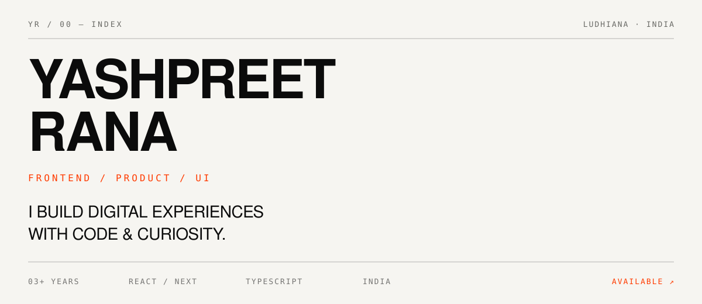
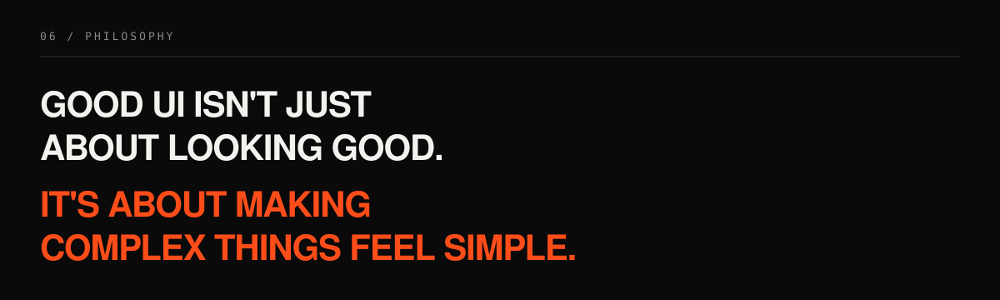
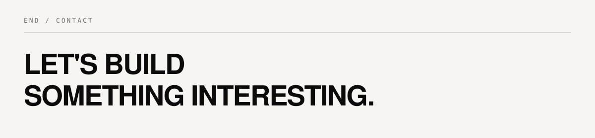

<!--
  Yashpreet Rana — Editorial profile README
  Designed as a mini portfolio, not a template.
-->

<p align="center">
  
</p>

<p align="center">
  <code>PORTFOLIO ↗</code>&nbsp;&nbsp;<a href="https://portnotes.vercel.app">portnotes.vercel.app</a>
  &nbsp;&nbsp;·&nbsp;&nbsp;
  <code>LINKEDIN ↗</code>&nbsp;&nbsp;<a href="https://www.linkedin.com/in/yashpreetrana/">/in/yashpreetrana</a>
  &nbsp;&nbsp;·&nbsp;&nbsp;
  <code>EMAIL ↗</code>&nbsp;&nbsp;<a href="mailto:yashpreet.rana.dev@gmail.com">yashpreet.rana.dev@gmail.com</a>
  &nbsp;&nbsp;·&nbsp;&nbsp;
  <code>TEL ↗</code>&nbsp;&nbsp;<a href="tel:+918288927607">+91 8288927607</a>
</p>

<br/>

```
INDEX
──────────────────────────────────────────────────────────────
01  PROFILE
02  HOW I WORK
03  SELECTED WORK
04  STACK
05  CURRENTLY
06  PHILOSOPHY
END CONTACT
```

<br/>


<br/>

## `01 / PROFILE`

<table>
  <tr>
    <td width="42%" valign="top">

### FRONTEND<br/>ENGINEER

```
EXPERIENCE   03+ YEARS
LOCATION     LUDHIANA, PUNJAB
OPEN TO      REMOTE · ON-SITE
FOCUS        PRODUCT ENGINEERING
```

    </td>
    <td width="58%" valign="top">

I build production web applications with **React.js** and **Next.js** — the kind that have to ship, scale, and stay maintainable after the sprint ends.

My work sits at the intersection of **UI architecture**, **performance**, **accessibility**, and **product thinking**. I collaborate closely with clients and cross-functional teams — designers, backend engineers, QA — to translate business needs into practical product experiences.

Not just screens. Systems.

<br/>

```js
// operating principles
const craft = [
  "architecture before ornament",
  "performance as a feature",
  "accessibility by default",
  "polish after it works",
];
```

    </td>
  </tr>
</table>

<br/>


<br/>

## `02 / HOW I WORK`

A process, not a performance.

<table>
  <tr>
    <td width="50%" valign="top">

```
01  UNDERSTAND
    What problem are we actually solving?

02  STRUCTURE
    How should the interface and
    architecture behave?

03  BUILD
    Turn the system into maintainable
    production code.

04  POLISH
    Improve the details that make
    the product feel finished.
```

    </td>
    <td width="50%" valign="top">

```
CLIENT NEED
     │
     ▼
 UNDERSTAND
     │
     ▼
 TRANSLATE
     │
     ▼
   BUILD
     │
     ▼
  ITERATE
     │
     ▼
    SHIP
```

I don’t only write frontend code.  
I sit with requirements, ask better questions, and help turn ambiguity into interfaces people can actually use.

    </td>
  </tr>
</table>

<br/>


<br/>

## `03 / SELECTED WORK`

Editorial case notes — not a card grid.

<br/>

### `01` &nbsp;&nbsp; VERIHIRE

**Interview Management Platform**

```
ROLE          PRODUCT ENGINEERING · FOUNDATION ARCHITECTURE
STACK         REACT · MUI · REDUX TOOLKIT · RTK QUERY
STATUS        PRODUCTION
LINK          https://my.verihire.ai
```

Designed and developed the project foundation from the ground up. Collaborated with design, backend, and QA across Agile cycles. Owned versioning discipline with SemVer / Semversioner.

→ [Open live product](https://my.verihire.ai)

<br/>

### `02` &nbsp;&nbsp; BEST VOCABULARY

**AI-Powered Vocabulary Learning Platform**

```
ROLE          FRONTEND ENGINEERING · UX SYSTEMS
STACK         NEXT.JS · JAVASCRIPT · TAILWIND CSS · REST APIS
STATUS        PRODUCTION
LINK          https://www.bestvocabulary.com
REPO          github.com/Yashpreetrana4790/Bestvocabulary_platform
```

Built modern responsive interfaces and reusable UI systems — cards, badges, navigation, progress. Developing engagement flows: saved words, XP/rank progression, emblem unlocks, and calendar-based Word of the Day browsing.

→ [Live](https://www.bestvocabulary.com/) · [Repository](https://github.com/Yashpreetrana4790/Bestvocabulary_platform)

<br/>

### `03` &nbsp;&nbsp; DEVOVERFLOW

**Full-stack Stack Overflow Clone**

```
ROLE          FULL-STACK NEXT.JS ENGINEERING
STACK         NEXT.JS 14 · TYPESCRIPT · TAILWIND · CLERK · MONGODB
STATUS        LIVE
LINK          https://advancenextjs13.vercel.app
REPO          github.com/Yashpreetrana4790/advancenextjs13
```

App Router, Server Actions, and caching strategies for efficient data handling. Secure authentication with Clerk. Backend logic designed for clean client–server communication.

→ [Live](https://advancenextjs13.vercel.app/) · [Repository](https://github.com/Yashpreetrana4790/advancenextjs13)

<br/>

### `04` &nbsp;&nbsp; EARTHLINK · CLOUDWICK

**Large-scale platform contributions**

```
EARTHLINK     ISP PLATFORM — UI / API STABILITY
CLOUDWICK     DATA & ANALYTICS — STAFFING ENGINEER
FOCUS         A11Y · LOCALIZATION · PERFORMANCE · RELIABILITY
RESULT        LIGHTHOUSE 90+ ACROSS ~90% OF PLATFORM PAGES
```

Debugged critical UI and API issues on a large ISP platform. On Cloudwick, improved accessibility, localization, frontend reliability, and SEO/performance metrics under real production pressure.

<br/>

### EXPERIENCE TIMELINE

```
DIGIMANTRA                          SEP 2024 — AUG 2026
React Developer · On-site · Ludhiana
8+ production projects · Next.js 14 · RTK Query · TypeScript

TWS / TEKKI WEB SOLUTIONS           JUN 2023 — SEP 2024
Next.js Developer · On-site · Ludhiana
Next.js 13 · Tailwind · Figma → production interfaces
```

<br/>


<br/>

## `04 / STACK`

Technical specification — not a badge wall.

<table>
  <tr>
    <td width="25%" valign="top">

```
FRONTEND
────────
React.js
Next.js
TypeScript
JavaScript
Tailwind CSS
HTML5 / CSS3
```

    </td>
    <td width="25%" valign="top">

```
STATE / DATA
────────────
Redux Toolkit
RTK Query
REST APIs
Async JS
Client–Server
```

    </td>
    <td width="25%" valign="top">

```
PLATFORM
────────
Node.js
MongoDB
Mongoose
Clerk
Server Actions
```

    </td>
    <td width="25%" valign="top">

```
TOOLS
─────
Git / GitHub
Figma
Agile
Vercel
SemVer
```

    </td>
  </tr>
</table>

```
PRINCIPLES
Responsive systems · Component architecture · Performance
Cross-browser reliability · Accessibility (A11y) · Maintainability
```

<br/>


<br/>

## `05 / CURRENTLY`

<table>
  <tr>
    <td width="25%" valign="top">

**BUILDING**

```
Production
React / Next.js
applications
```

    </td>
    <td width="25%" valign="top">

**LEARNING**

```
German
```

    </td>
    <td width="25%" valign="top">

**EXPLORING**

```
CI / CD
Cloud
Performance
Scalability
```

    </td>
    <td width="25%" valign="top">

**INTERESTED IN**

```
Product Eng
Frontend Architecture
Developer Experience
```

    </td>
  </tr>
</table>

```
EDUCATION     BCA · CT UNIVERSITY · 2020–2023 · 7 CGPA
CERTS         JavaScript Advanced · Next.js Advanced
LANGUAGES     English · Hindi · Punjabi · German
```

<br/>


<br/>

<p align="center">
  
</p>

<br/>


<br/>

<p align="center">
  
</p>

<p align="center">
  <a href="https://portnotes.vercel.app"><strong>PORTFOLIO ↗</strong></a>
  &nbsp;&nbsp;&nbsp;&nbsp;
  <a href="https://www.linkedin.com/in/yashpreetrana/"><strong>LINKEDIN ↗</strong></a>
  &nbsp;&nbsp;&nbsp;&nbsp;
  <a href="https://github.com/Yashpreetrana4790"><strong>GITHUB ↗</strong></a>
  &nbsp;&nbsp;&nbsp;&nbsp;
  <a href="mailto:yashpreet.rana.dev@gmail.com"><strong>EMAIL ↗</strong></a>
</p>

<br/>

<details>
  <summary><code>// contribution graph — living system</code></summary>
  <br/>
  <p align="center">
    <picture>
      <source media="(prefers-color-scheme: dark)" srcset="https://raw.githubusercontent.com/Yashpreetrana4790/Yashpreetrana4790/output/snake-dark.svg" />
      <source media="(prefers-color-scheme: light)" srcset="https://raw.githubusercontent.com/Yashpreetrana4790/Yashpreetrana4790/output/snake-light.svg" />
      
    </picture>
  </p>
</details>

<br/>

```
EOF

// still curious.
```
